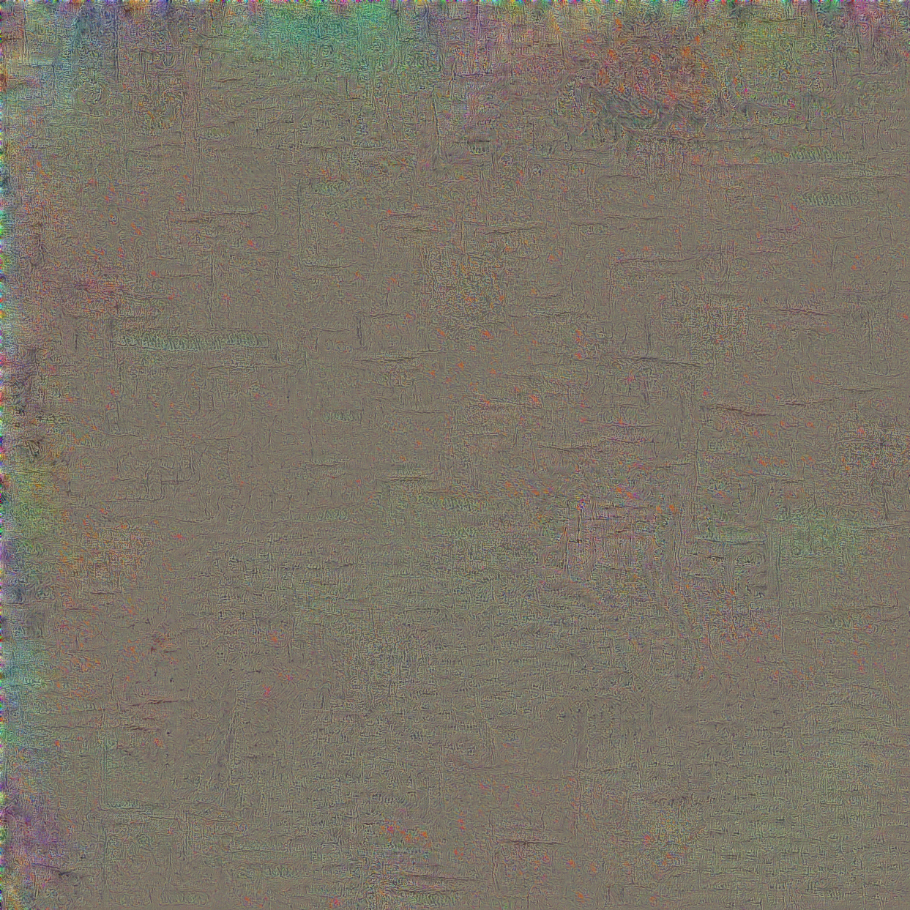

# CNN Explainer

В этом репозитории содержится код, который я использовал для интерпретации результатов свёрточной нейросети ResNet 18. Инструкции по запуску и описание кода содержатся в оригинальном репозитории:
```
https://github.com/gsurma/cnn_explainer
```
Основная папка с изображениями *pictures_to_explain* большая, поэтому помещена отдельно на Google-диск.
```
https://drive.google.com/drive/folders/1xNO-77vrMphmrtylGu_vYakmun9l939C?usp=sharing
```
В папке *pictures_to_explain* находятся изображения, на которых были проведены эксперименты. В папке *src* находятся исходные изображения, в папках *np* и *im* находятся изображения и хитмапы, полученные с помощью numpy и imutils, соответственно. Внутри папок *np* и *im* находятся папки, названия которых отражают эксперимент. 

## Примеры полученных картинок
---
Area importance heatmap
 
---
GradCam heatmap

---
Feature visualization

---